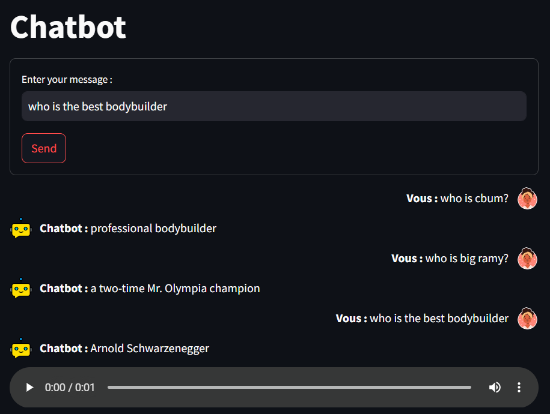

# LangChainRAGChatbot

A chatbot powered by **Retrieval-Augmented Generation (RAG)** and **LangChain**, designed for intelligent, context-aware question answering. The bot features a speech-to-text option for seamless interaction and utilizes a custom FastAPI backend for retrieval-based responses.

---

## Features

- **RAG Pipeline**: Combines document retrieval with a generative model to provide accurate and contextual answers.
- **Speech-to-Text Integration**: Converts chatbot responses into audio using **gTTS** for enhanced interactivity.
- **Streamlit Frontend**: User-friendly web interface for conversation and chatbot interaction.
- **FastAPI Backend**: Efficient API built for RAG pipeline processing.
- **Customizable Knowledge Base**: Add or modify documents for specific use cases such as bodybuilding, technology, etc.

---

### Chat Interface

---

## How It Works

1. **Frontend**: The user interacts with the chatbot using the **Streamlit** app.
2. **Backend**: The query is sent to the FastAPI server, where:
   - Relevant documents are retrieved using **FAISS**.
   - A response is generated using the RAG pipeline with a local **Hugging Face** model.
3. **Response Playback**: The chatbot's response is converted to speech and played back for the user.

---

### Prerequisites
- Python 3.8+
- Libraries: `langchain`, `transformers`, `faiss-cpu`, `fastapi`, `uvicorn`, `pyngrok`, `streamlit`, `gtts`, `requests`

---

### Example Workflow
1. Enter a question in the chat input box.
2. Receive the response as text and audio.
3. Play the audio directly from the app.

---

## Customization
### Adding Documents
Modify the documents variable in the backend to add your knowledge base.

### Changing Language for Speech-to-Text
Update the gTTS language code in the speak_text function:

---

### Roadmap
- Add real-time speech recognition for user input.
- Deploy the chatbot on platforms like AWS or Azure.
- Expand the knowledge base for broader topics. 

---

### License
This project is licensed under the MIT License.
